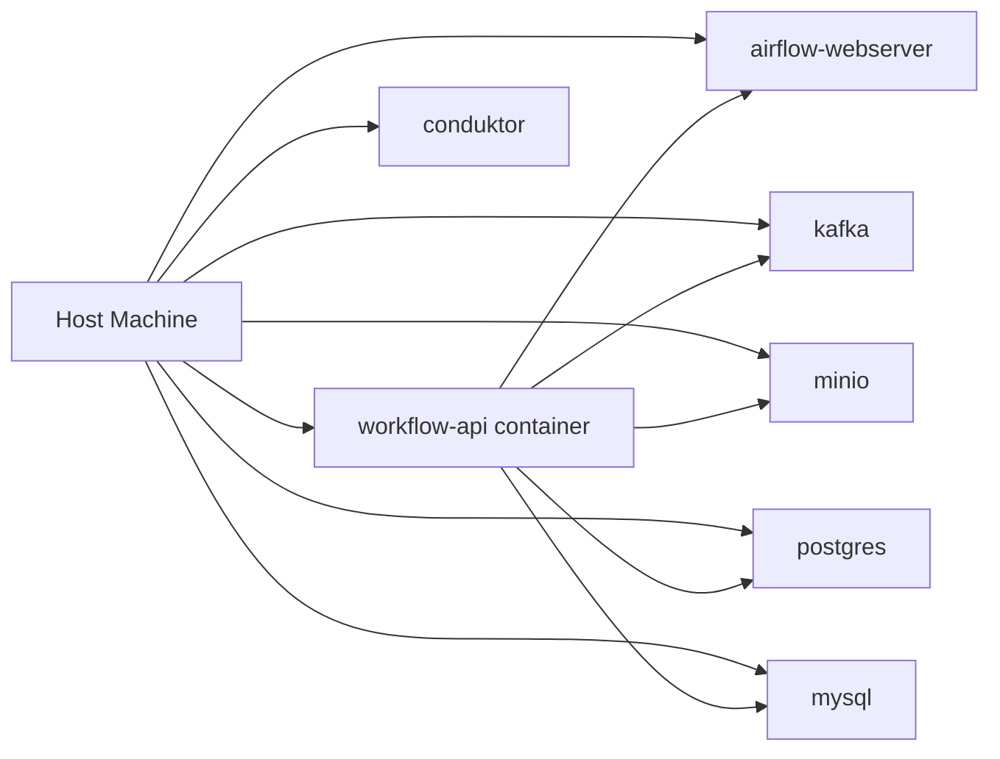
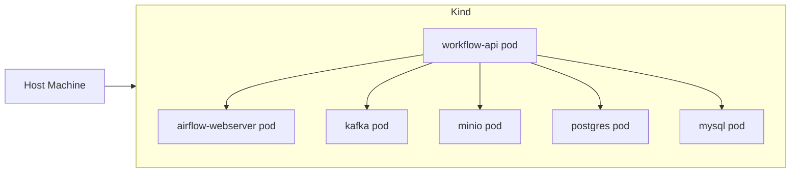
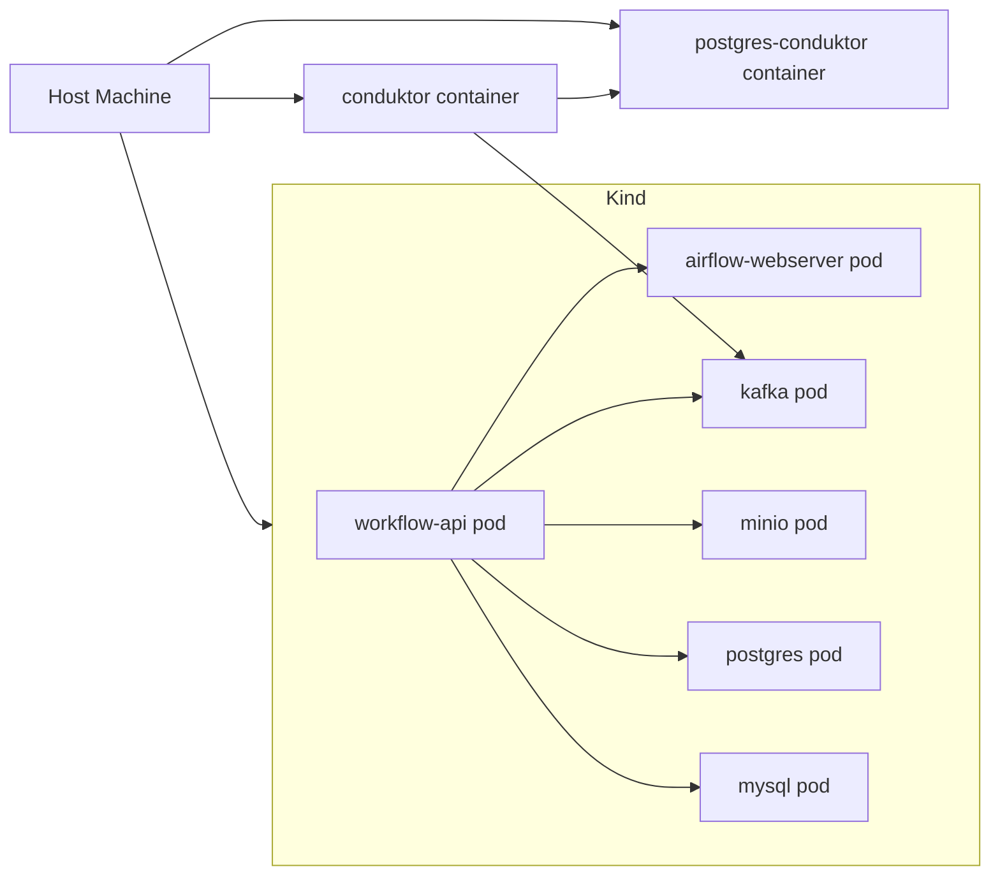
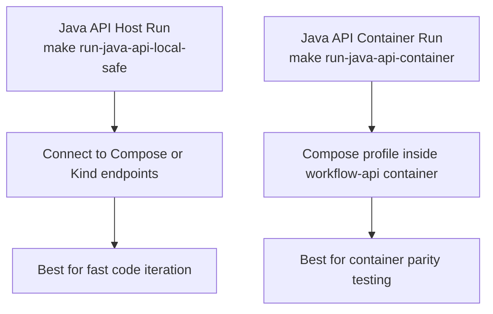

# Local Development Procedure

Use this guide for a repeatable local setup across Docker Compose, host-run Java API, and optional Kind validation.

For local documentation preview, run `make run-wiki` (override with `WIKI_PORT=<port>`).

## Scope

Use this guide when you need:

- Platform dependencies running in Docker Compose.
- Java API running on host (recommended) or as a container.
- Airflow, Kafka, MinIO, Postgres, and Conduktor integration available for end-to-end testing.
- Local Kubernetes deployment on Kind for container-level validation.

## Architecture Notes (Local)

This stack intentionally uses **two Postgres services**:

- `postgres` on `localhost:5432`: main project database (`processed_db`).
- `postgres-conduktor` on `localhost:5433`: Conduktor metadata database (`conduktor_db`).

This separation prevents Conduktor metadata from interfering with project data.

## Current Repository Snapshot

- CI workflow: `.github/workflows/ci.yml`
- CD workflow: `.github/workflows/cd.yml`
- Branch and environment flow: push `dev` for CI/dev checks, PR to `qa`/`stg`/`prd` for env-specific CI checks and Helm CD deployment.
- Kind assets: `k8s/kind/cluster-config.yaml`, `k8s/kind/stack.yaml`, `k8s/kind/README.md`
- Kind operations: `ops/deploy-kind.sh`, `ops/kind-smoke.sh`
- Local docs viewer: `devtools/serve_wiki.py` (route `/wiki?doc=<path>`)

Use these docs for implementation context:

- `README.md` for top-level project map
- `docs/ARCHITECTURE.md` for platform architecture
- `docs/DEPLOYMENT.md` for progressive delivery patterns

## Prerequisites

1. Docker Desktop running.
2. Docker Compose available.
3. Java 17 and Maven installed on host.
4. Optional: Python environment for validation utilities.

## Quick Start (Recommended Daily Path)

Use this path for day-to-day local development with Compose services and host-run API.

Run these commands from repository root:

```bash
make up
make ps
make run-java-api-local-safe
```

In another terminal, validate readiness:

```bash
curl -sS http://localhost:8081/actuator/health
curl -sS http://localhost:8081/api/monitor/health
```

If both checks are healthy, proceed with API and pipeline tests.

## Quick Start (Local Kubernetes with Kind)

Use this path when you need Kubernetes manifest and container-runtime validation locally.

Kind-only deployment:

```bash
make kind-deploy
make kind-status
```

Hybrid deployment (Kind + local support services):

```bash
make hybrid-up
make hybrid-status
```

Kind endpoints (from host):

- Airflow UI: http://localhost:8080
- Workflow API: http://localhost:8081
- MinIO API: http://localhost:9000
- MinIO Console: http://localhost:9001
- Kafka broker: localhost:9092

Destroy local Kind cluster:

```bash
make kind-down
```

Destroy hybrid runtime (Kind + support services):

```bash
make hybrid-down
```

## Deployment Diagrams by Configuration

Use these diagrams to choose the right local runtime mode before executing procedures.

### 1. Pure Docker Compose (All Services in Compose)



### 2. Kind-Only Local Kubernetes



### 3. Hybrid (Kind App Stack + Compose Support Services)



### 4. Java API Runtime Options



## K8s in Docker (Kind) End-to-End Runbook

Use this procedure when you want a full local Kubernetes validation cycle on Docker.

1. Move to repository root.

```bash
cd /Users/pchen/mygithub/Modern-Enterprise-Data-Stack
```

2. Clean old runtime state (safe reset).

```bash
make down
make kind-down
```

3. Create and deploy local Kind stack.

```bash
make kind-up
make kind-deploy
```

4. Verify workload status.

```bash
make kind-status
```

5. Run smoke checks.

```bash
make kind-smoke
```

6. Optional hybrid mode (Kind + Compose support services only).

```bash
make hybrid-up
make hybrid-status
```

7. Optional API container startup (auto port selection if 8081 is busy).

```bash
make run-java-api-container
```

8. Tear down when done.

```bash
make kind-down
make down
```

## Pure Docker Compose End-to-End Runbook

Use this procedure when you want local development without Kind.

1. Move to repository root.

```bash
cd /Users/pchen/mygithub/Modern-Enterprise-Data-Stack
```

2. Clean old runtime state.

```bash
make kind-down
make down
```

3. Start full Compose stack.

```bash
make up
make ps
```

4. Start Java API on host (recommended for fast iteration).

```bash
make run-java-api-local-safe
```

5. Validate readiness.

```bash
curl -sS http://localhost:8081/actuator/health
curl -sS http://localhost:8081/api/monitor/health
```

6. Optional API container mode (Compose profile).

```bash
make build-java-api-container
make run-java-api-container
```

7. Optional pipeline execution checks.

```bash
make run-kafka-producer
make run-batch-job
make run-iceberg-demo
```

8. Validate before commit.

```bash
make validate
```

9. Tear down when done.

```bash
make down
```

10. Full cleanup (including volumes).

```bash
make clean
```

## Java API Procedure (Separate Flow)

Use this section when you only want to start, verify, and stop the Java API.

### Java API Flow A: Host Run (Recommended)

1. Start required dependencies.

```bash
make up
```

2. Start API with local profile.

```bash
make run-java-api-local-safe
```

3. Verify health and dependency visibility.

```bash
curl -sS http://localhost:8081/actuator/health
curl -sS http://localhost:8081/api/monitor/health
```

4. Run API smoke requests.

```bash
curl -sS -X POST http://localhost:8081/api/batch/ingest -H 'Content-Type: application/json' -d '{"sourceTable":"orders","runGreatExpectations":false,"triggerAirflow":false}'
curl -sS -X POST http://localhost:8081/api/stream/produce -H 'Content-Type: application/json' -d '{"partition":0,"payload":{"device_id":1001,"reading_value":72.5}}'
```

### Java API Flow B: Container Run (Compose Profile)

1. Start API container (with build).

```bash
make build-java-api-container
make run-java-api-container
```

2. Read the printed URL and verify health.

```bash
curl -sS http://localhost:8081/actuator/health
```

Note: if 8081 is busy, `make run-java-api-container` auto-selects another host port in the configured range and prints it.

3. Inspect logs when troubleshooting startup.

```bash
make logs-java-api-container
```

4. Stop container when done.

```bash
make stop-java-api-container
```

## Procedure

Follow these steps in order for a consistent local workflow.

## 1. Start Platform Services

Start baseline Compose dependencies before running APIs or pipeline commands.

```bash
make up
```

Verify service state:

```bash
make ps
```

View logs when startup is slow or unhealthy:

```bash
make logs
```

## 2. Local Endpoints and Credentials

Use these endpoints and defaults for local smoke tests and manual verification.

Core endpoints:

- Airflow UI: http://localhost:8080
- Java API (host run): http://localhost:8081
- MinIO API: http://localhost:9000
- MinIO Console: http://localhost:9001
- Conduktor UI: http://localhost:8085/app
- Prometheus: http://localhost:9090
- Grafana: http://localhost:3000

Database endpoints:

- Project Postgres: localhost:5432 (`processed_db`)
- Conduktor Postgres: localhost:5433 (`conduktor_db`)

Default local credentials:

- Airflow: `airflow_user` / `airflow_pass`
- Conduktor: `admin@local.dev` / `admin123`

## 3. Run Java API (Profile Decision)

Choose profile by runtime location to avoid networking mismatch errors.

Use the correct profile based on where the API runs.

- Host-run API: use `local` profile.
- Container-run API: use `compose` profile.

Recommended (safe host run):

```bash
make run-java-api-local-safe
```

Why this is preferred:

- Automatically handles stale process conflicts on port `8081`.
- Uses the right host networking assumptions for local development.
- Reduces startup failures from manual process cleanup mistakes.

Alternative commands:

```bash
make run-java-api-local
make run-java-api-compose
```

Direct Maven command (host run):

```bash
cd java-api
mvn spring-boot:run -Dspring-boot.run.profiles=local -DskipTests
```

Run API as container service:

```bash
make build-java-api-container
make run-java-api-container
```

Container API logs and stop:

```bash
make logs-java-api-container
make stop-java-api-container
```

## 4. Development Loop (Fast Iteration)

Use this loop for quick code-test-debug cycles.

1. Ensure `make up` is active.
2. Start API with `make run-java-api-local-safe`.
3. Execute API requests.
4. Validate side effects in Airflow, Kafka, MinIO, and Postgres.
5. Repeat after code changes.

Common API endpoints:

- `POST /api/batch/ingest`
- `POST /api/stream/produce`
- `POST /api/stream/run`
- `POST /api/governance/lineage`
- `POST /api/ml/run`
- `POST /api/ci/trigger`
- `GET /api/monitor/health`

## 5. Pipeline and Data Commands (Container Side)

Run these targets to exercise Kafka, Spark, and storage paths end to end.

From repository root:

```bash
make run-kafka-producer
make run-streaming-job
make run-batch-job
make run-iceberg-demo
```

Behavior note:

- `run-batch-job` and `run-iceberg-demo` auto-seed demo data via `prepare-demo-data`.

## 6. Validation Before Commit

Run validation before opening a PR or merging local changes.

```bash
make validate
```

Optional formatting:

```bash
make format
```

## 7. Shutdown and Cleanup

Use `down` for normal stop; use `clean` when you need a full reset.

Stop services:

```bash
make down
```

Stop and remove containers plus volumes:

```bash
make clean
```

## Troubleshooting Matrix

Use this section to diagnose the most common local runtime failures.

### A) Java API startup fails with exit code 1

Likely causes:

- Port `8081` already in use.
- Wrong runtime profile for current network topology.

Actions:

```bash
make run-java-api-local-safe
lsof -nP -iTCP:8081 -sTCP:LISTEN
```

If running host-side API, ensure profile is `local`, not `compose`.

### B) API is up but dependency health fails

Actions:

```bash
make ps
make logs
curl -sS http://localhost:8081/api/monitor/health
```

Interpretation:

- If dependencies show unavailable, confirm service containers are healthy before retrying API workflows.

### C) Airflow DAG not running

Likely causes:

- DAG is paused.
- Task is retrying due to dependency errors.

Actions:

```bash
docker-compose --project-directory . -f infra/compose/docker-compose.yaml exec -T airflow-webserver airflow dags list
docker-compose --project-directory . -f infra/compose/docker-compose.yaml exec -T airflow-webserver airflow dags unpause batch_ingestion_dag
docker-compose --project-directory . -f infra/compose/docker-compose.yaml exec -T airflow-webserver airflow dags trigger batch_ingestion_dag
```

### D) Conduktor cannot start or cannot persist state

Checks:

- Ensure `postgres-conduktor` is up on `5433`.
- Ensure Conduktor points to `postgres-conduktor` in compose env.

Actions:

```bash
docker-compose --project-directory . -f infra/compose/docker-compose.yaml ps postgres-conduktor conduktor
docker-compose --project-directory . -f infra/compose/docker-compose.yaml logs conduktor
```

### E) Iceberg/batch demo missing source data

```bash
make prepare-demo-data
make run-iceberg-demo
```

## Operational Tips

- Keep one terminal for long-running services (`make up`, API run command).
- Use a second terminal for `curl`, DAG triggers, and diagnostics.
- Prefer Make targets over direct long commands to reduce local inconsistencies.
