# 🚀 Modern Data Stack with Batch & Streaming Processing 🌈

This repository provides a production-ready data platform for both batch and streaming workloads.

What you get:

- Batch ingestion with Airflow and Spark.
- Streaming ingestion with Kafka and Spark Structured Streaming.
- Data quality checks with Great Expectations.
- Apache Iceberg table format for ACID analytics tables.
- Storage in MinIO, PostgreSQL, MongoDB, InfluxDB, and optional AWS S3.
- Monitoring with Prometheus and Grafana.
- Governance and ML stubs (Apache Atlas/OpenMetadata, MLflow, Feast).
- Deployment paths for Docker Compose, Kubernetes, and Terraform.

Core stack: Python, SQL, Bash, Docker, Kubernetes, Airflow, Spark, Flink, Kafka, Hadoop, Iceberg, PostgreSQL, MySQL, MongoDB, InfluxDB, MinIO, Prometheus, Grafana, MLflow, Feast, Great Expectations, Terraform.

For a fast setup path, see `docs/QUICK_START.md`. Use this README for full architecture and customization details.

Container layout and compose/dockerfile conventions are documented in `infra/README.md`.

Use `Makefile` targets to standardize daily operations:

- `make help` to list all available commands
- `make up`, `make ps`, `make logs`, `make down` for lifecycle operations
- `make validate` for end-to-end project validation
- `make format` for repository formatting

## <span style="color: #0ea5e9;">High-Level Component Diagram</span>

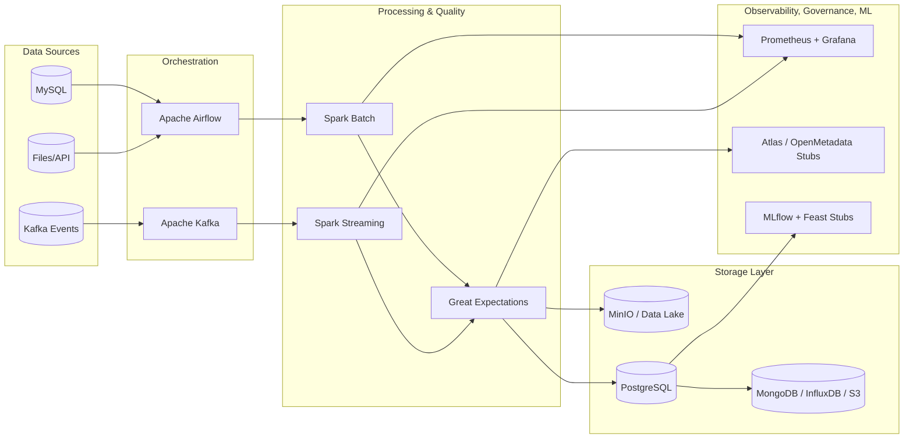

## <span style="color: #0ea5e9;">Deployment Architecture Diagram</span>

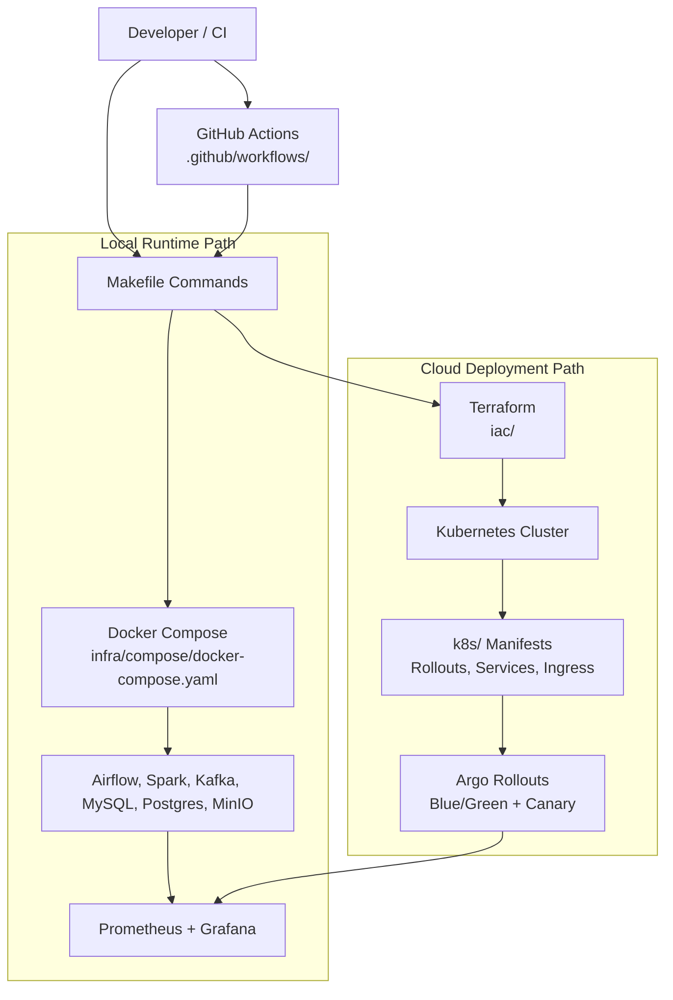

## <span style="color: #0ea5e9;">Operations Quickstart</span>

Use this section when you want to deploy, verify health, and monitor the stack quickly.

1. Start the platform:

```bash
make up
```

2. Verify core services are running:

```bash
make ps
```

3. Verify service endpoints:

- Airflow: http://localhost:8080
- Grafana: http://localhost:3000
- Prometheus: http://localhost:9090
- MinIO Console: http://localhost:9001

4. Check logs for failed services:

```bash
make logs
```

5. Run pipelines:

- Enable `batch_ingestion_dag` in Airflow for batch execution.
- Run `make run-kafka-producer` and `make run-streaming-job` for streaming.

6. Use the runbook:

- See the `Operational Runbook` section for failure triage and recovery steps.

## <span style="color: #0ea5e9;">Table of Contents</span>

1. [High-Level Component Diagram](#high-level-component-diagram)
2. [Deployment Architecture Diagram](#deployment-architecture-diagram)
3. [Operations Quickstart](#operations-quickstart)
4. [Make Procedures](#make-procedures)
5. [Setup Instructions](#setup-instructions)
6. [Operational Runbook](#operational-runbook)
7. [Architecture Overview](#architecture-overview)
8. [Directory Structure](#directory-structure)
9. [Components & Technologies](#components--technologies)
10. [Configuration & Customization](#configuration--customization)
11. [Example Applications](#example-applications)
12. [Troubleshooting & Further Considerations](#troubleshooting--further-considerations)
13. [Contributing](#contributing)
14. [License](#license)
15. [Final Notes](#final-notes)
16. [Iceberg Tables Guide](docs/ICEBERG.md)

## <span style="color: #0ea5e9;">Make Procedures</span>

Use `make` as the primary entry point for project operations.

### <span style="color: #22c55e;">Available Make Targets</span>

```bash
make help
```

This prints all supported targets and descriptions from the root `Makefile`.

### <span style="color: #22c55e;">Core Lifecycle Commands</span>

```bash
make up
make ps
make logs
```

- `make up`: build and start core services in detached mode
- `make ps`: inspect container health/status
- `make logs`: tail core service logs (`airflow`, `spark`, `kafka`, `postgres`, `mysql`)

Shutdown and cleanup:

```bash
make down
make clean
```

- `make down`: stop services
- `make clean`: stop services and remove volumes

### <span style="color: #22c55e;">Validation Commands</span>

Run complete repository validation:

```bash
make validate
```

Run individual checks:

```bash
make validate-compose
make validate-shell
make validate-python
make validate-json
make validate-yaml
make validate-notebook
make validate-format
make validate-terraform
```

### <span style="color: #22c55e;">Formatting Commands</span>

Format all supported components:

```bash
make format
```

Or run by scope:

```bash
make format-python
make format-text
make terraform-fmt
```

### <span style="color: #22c55e;">Terraform Commands</span>

```bash
make terraform-init
make terraform-validate
```

Use these targets after Terraform changes and before committing infrastructure updates.

### <span style="color: #22c55e;">Streaming Commands</span>

```bash
make run-kafka-producer
make run-streaming-job
make run-batch-job
make run-iceberg-demo
```

These targets run producer/batch/streaming Spark jobs inside the compose stack.

### <span style="color: #22c55e;">Legacy Command Mapping</span>

- `docker-compose up --build -d` -> `make up`
- `docker-compose ps` -> `make ps`
- `docker-compose logs --tail=200 airflow spark kafka postgres mysql` -> `make logs`
- `docker-compose down` -> `make down`
- `docker-compose down -v` -> `make clean`
- `terraform -chdir=iac fmt -recursive` -> `make terraform-fmt`
- `terraform -chdir=iac validate` -> `make terraform-validate`

## <span style="color: #0ea5e9;">Architecture Overview</span>

The Modern Data Stack architecture is designed to handle both batch and streaming data processing. Below is a high-level overview of the components and their interactions:

### <span style="color: #22c55e;">End-to-End System Diagram</span>

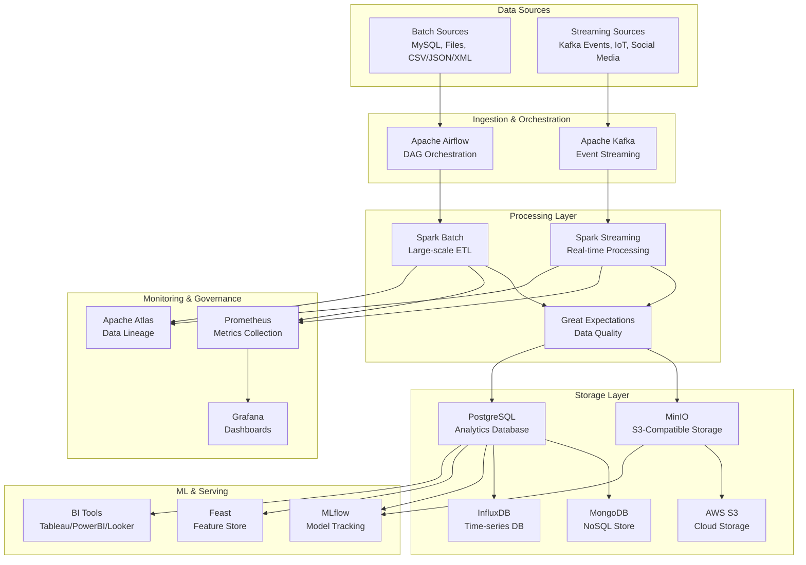

### <span style="color: #22c55e;">Data Flow Summary</span>

Data is ingested from batch and streaming sources, orchestrated by Airflow/Kafka, processed with Spark, validated by Great Expectations, and persisted to MinIO/PostgreSQL (with optional downstream stores). Prometheus and Grafana provide operational visibility, while MLflow and Feast support ML workflows.

> [!CAUTION]
> Diagrams are high-level and may omit some optional components included in the repository.

### <span style="color: #22c55e;">Batch Processing Sequence</span>

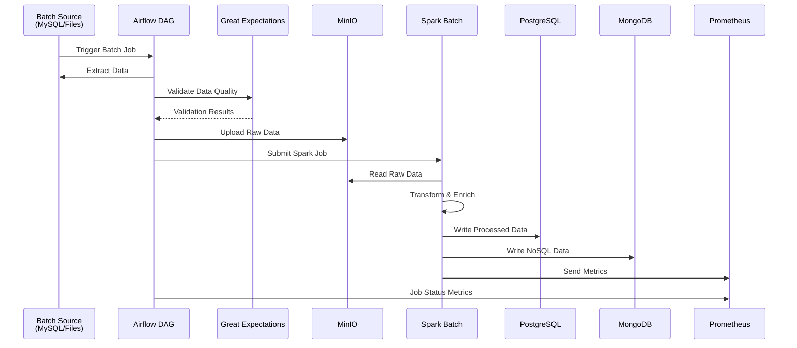

### <span style="color: #22c55e;">Streaming Processing Sequence</span>

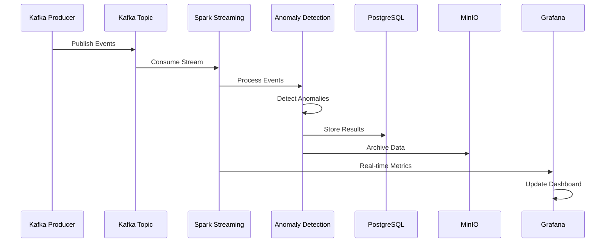

### <span style="color: #22c55e;">Data Quality and Governance Flow</span>

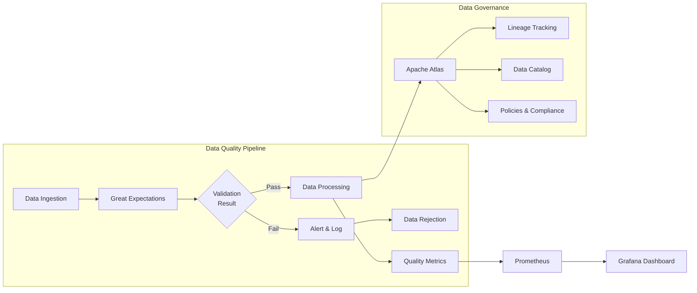

### <span style="color: #22c55e;">CI/CD and Deployment Flow</span>

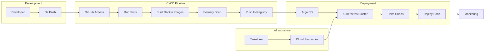

### <span style="color: #22c55e;">Unified Platform Flow</span>

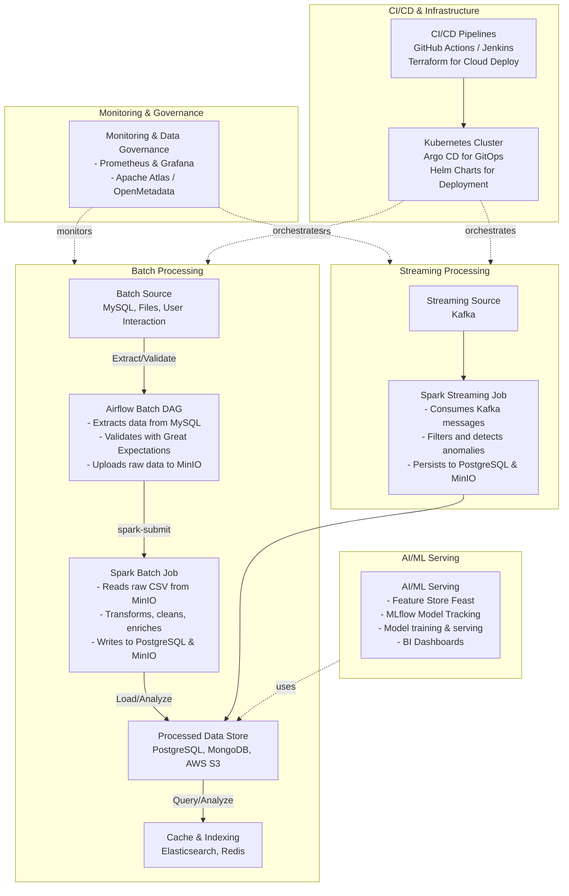

### <span style="color: #22c55e;">Full Flow Reference</span>

A more detailed flow diagram that includes backend and frontend integration is available in `assets/full_flow_diagram.png`. It illustrates how pipeline components interact with external systems across data sources, storage, processing, visualization, and monitoring.

Although frontend/backend integration is not implemented in this repository (which focuses on pipeline concerns), it can be added to an existing React, Angular, or Vue application.

### <span style="color: #22c55e;">Runtime Infrastructure View</span>

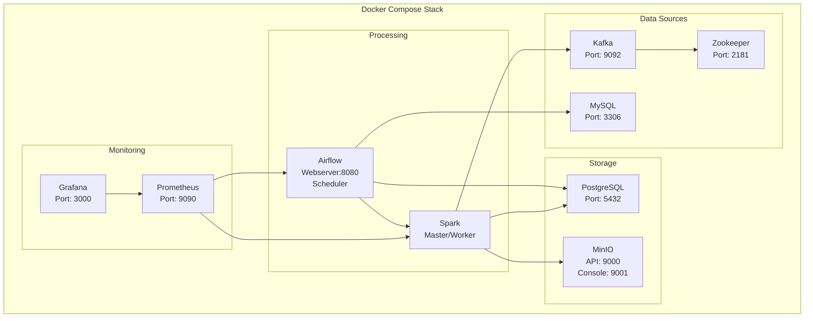

### <span style="color: #22c55e;">ML Lifecycle View</span>

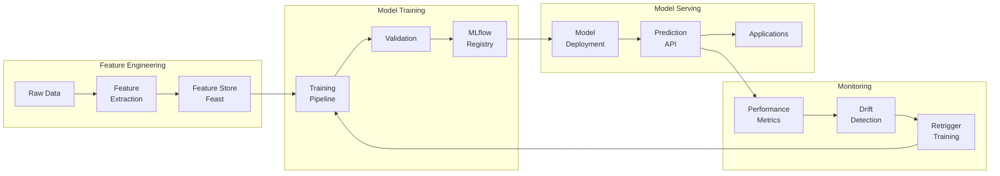

## <span style="color: #0ea5e9;">Directory Structure</span>

```
modern-data-stack/
  ├── README.md
  ├── Makefile
  ├── LICENSE
  ├── .github/
  ├── .devcontainer/
  ├── docs/
  │   ├── QUICK_START.md
  │   ├── ARCHITECTURE.md
  │   └── DEPLOYMENT_STRATEGIES.md
  ├── pipelines/
  │   ├── airflow/
  │   ├── spark/
  │   ├── kafka/
  │   ├── storage/
  │   ├── great_expectations/
  │   ├── governance/
  │   ├── monitoring/
  │   ├── ml/
  │   └── bi_dashboards/
  ├── infra/
  │   ├── compose/
  │   │   ├── docker-compose.yaml
  │   │   └── docker-compose.ci.yaml
  │   ├── dockerfiles/
  │   │   ├── airflow.Dockerfile
  │   │   ├── spark.Dockerfile
  │   │   └── sample_dotnet_backend.Dockerfile
  │   └── README.md
  ├── iac/
  ├── k8s/
  ├── ops/
  │   ├── deploy-blue-green.sh
  │   ├── deploy-canary.sh
  │   ├── init_db.sql
  │   ├── setup-advanced-deployments.sh
  │   └── operations/
  ├── dotnet-api/
  ├── notebooks/
  │   └── modern-data-stack.ipynb
  ├── web/
  │   ├── index.html
  │   ├── styles.css
  │   └── script.js
  └── devtools/
      └── serve_wiki.py
```

## <span style="color: #0ea5e9;">Components & Technologies</span>

- **Ingestion & Orchestration:**
  - [Apache Airflow](https://airflow.apache.org/) – Schedules batch and streaming jobs.
  - [Kafka](https://kafka.apache.org/) – Ingests streaming events.
  - [Spark](https://spark.apache.org/) – Processes batch and streaming data.

- **Storage & Processing:**
  - [MinIO](https://min.io/) – S3-compatible data lake.
  - [PostgreSQL](https://www.postgresql.org/) – Stores transformed and processed data.
  - [Great Expectations](https://greatexpectations.io/) – Enforces data quality.
  - [AWS S3](https://aws.amazon.com/s3/) – Cloud storage integration.
  - [InfluxDB](https://www.influxdata.com/) – Time-series data storage.
  - [MongoDB](https://www.mongodb.com/) – NoSQL database integration.
  - [Hadoop](https://hadoop.apache.org/) – Big data processing integration.

- **Monitoring & Governance:**
  - [Prometheus](https://prometheus.io/) – Metrics collection.
  - [Grafana](https://grafana.com/) – Dashboard visualization.
  - [Apache Atlas/OpenMetadata](https://atlas.apache.org/) – Data lineage and governance.

- **ML & Data Serving:**
  - [MLflow](https://mlflow.org/) – Experiment tracking.
  - [Feast](https://feast.dev/) – Feature store for machine learning.
  - [BI Tools](https://grafana.com/) – Real-time dashboards and insights.

## <span style="color: #0ea5e9;">Setup Instructions</span>

### <span style="color: #22c55e;">Prerequisites</span>

- **Docker** and **Docker Compose** must be installed.
- Ensure that **Python 3.9+** is installed locally if you want to run scripts outside of Docker.
- Open ports required:
  - Airflow: 8080
  - MySQL: 3306
  - PostgreSQL: 5432
  - MinIO: 9000 (and console on 9001)
  - Kafka: 9092
  - Prometheus: 9090
  - Grafana: 3000

### <span style="color: #22c55e;">Getting Started</span>

1. **Clone the Repository**

   ```bash
   git clone https://github.com/paulchen8206/Modern-Enterprise-Data-Stack.git
   cd Modern-Enterprise-Data-Stack
   ```

2. **Start the Pipeline Stack**

Use Make to launch all components:

```bash
make up
```

This command will:

- Build custom Docker images for Airflow and Spark.
- Start MySQL, PostgreSQL, Kafka (with Zookeeper), MinIO, Prometheus, Grafana, and Airflow webserver.
- Initialize the MySQL database with demo data (via `ops/init_db.sql`).

3. **Access the Services**
   - **Airflow UI:** [http://localhost:8080](http://localhost:8080)  
     Set up connections:
     - `mysql_default` → Host: `mysql`, DB: `source_db`, User: `user`, Password: `pass`
     - `postgres_default` → Host: `postgres`, DB: `processed_db`, User: `user`, Password: `pass`
   - **MinIO Console:** [http://localhost:9001](http://localhost:9001) (User: `minio`, Password: `minio123`)
   - **Kafka:** Accessible on port `9092`
   - **Prometheus:** [http://localhost:9090](http://localhost:9090)
   - **Grafana:** [http://localhost:3000](http://localhost:3000) (Default login: `admin/admin`)

4. **Run Batch Pipeline**
   - In the Airflow UI, enable the `batch_ingestion_dag` to run the end-to-end batch pipeline.
   - This DAG extracts data from MySQL, validates it, uploads raw data to MinIO, triggers a Spark job for transformation, and loads data into PostgreSQL.

5. **Run Streaming Pipeline**
   - Start the Kafka producer:
     ```bash
     make run-kafka-producer
     ```
   - In another terminal, run the Spark streaming job:
     ```bash
     make run-streaming-job
     ```
   - The streaming job consumes events from Kafka, performs real-time anomaly detection, and writes results to PostgreSQL and MinIO.

6. **Monitoring & Governance**
   - **Prometheus & Grafana:**  
     Use the `monitoring.py` script (or access Grafana) to view real-time metrics and dashboards.
   - **Data Lineage:**  
     The `pipelines/governance/atlas_stub.py` script registers lineage between datasets (can be extended for full Apache Atlas integration).

7. **ML & Feature Store**
   - Use `pipelines/ml/mlflow_tracking.py` to simulate model training and tracking.
   - Use `pipelines/ml/feature_store_stub.py` to integrate with a feature store like Feast.

8. **CI/CD & Deployment**
   - Use `infra/compose/docker-compose.ci.yaml` to set up CI/CD pipelines.
   - Use the `k8s/` directory for Kubernetes deployment manifests.
   - Use the `iac/` directory for cloud deployment scripts.
   - Use the `.github/workflows/` directory for GitHub Actions CI/CD workflows.

### <span style="color: #22c55e;">Customization Guidance</span>

This starter implementation is intentionally generic and should be customized for your domain, data contracts, and operating model.

> [!IMPORTANT]
> Note: Be sure to visit the files and scripts in the repository and change the credentials, configurations, and logic to match your environment and use case. Feel free to extend the pipeline with additional components, services, or integrations as needed.

## <span style="color: #0ea5e9;">Operational Runbook</span>

### <span style="color: #22c55e;">Health Verification Checklist</span>

- Confirm service states:

  ```bash
  make ps
  ```

- Inspect logs for critical services:

  ```bash
  make logs
  ```

- Validate DAG orchestration in Airflow UI:
  - Ensure `batch_ingestion_dag` and `streaming_monitoring_dag` are unpaused.
  - Confirm latest runs are successful.

- Validate data path:
  - Raw objects appear in MinIO buckets.
  - Processed records are visible in PostgreSQL.
  - Streaming anomalies are present after producer traffic.

### <span style="color: #22c55e;">Restart and Recovery</span>

- Restart all services:

  ```bash
  make restart
  ```

- Restart a specific service:

  ```bash
  docker-compose --project-directory . -f infra/compose/docker-compose.yaml restart airflow-webserver
  ```

- Rebuild after configuration changes:

  ```bash
  make up
  ```

- Tear down and clean environment:

  ```bash
  make clean
  ```

### <span style="color: #22c55e;">Production Readiness Notes</span>

- Keep infrastructure changes versioned in `k8s/` and `iac/`.
- Promote via CI/CD using `infra/compose/docker-compose.ci.yaml` and `.github/workflows/`.
- Apply credentials and environment-specific values through secrets management, not hardcoded files.

## <span style="color: #0ea5e9;">Configuration & Customization</span>

- **Docker Compose:**
  All services are defined in `infra/compose/docker-compose.yaml`. Adjust resource limits, environment variables, and service dependencies as needed.

- **Airflow:**  
  Customize DAGs in the `pipelines/airflow/dags/` directory. Use the provided PythonOperators to integrate custom processing logic.

- **Spark Jobs:**  
  Edit transformation logic in `pipelines/spark/spark_batch_job.py` and `pipelines/spark/spark_streaming_job.py` to match your data and processing requirements.

- **Kafka Producer:**  
  Modify `pipelines/kafka/producer.py` to simulate different types of events or adjust the batch size and frequency using environment variables.

- **Monitoring:**  
  Update `pipelines/monitoring/monitoring.py` and dashboard definitions in `pipelines/monitoring/` to fit your environment.

- **Governance & ML:**  
  Replace stub implementations in `pipelines/governance/atlas_stub.py` and `pipelines/ml/` with real integrations as needed.

- **CI/CD & Deployment:**  
  Customize CI/CD workflows in `.github/workflows/` and deployment manifests in `k8s/` and `iac/` for your cloud environment.

- **Storage:**

  Data storage options are in the `pipelines/storage/` directory with AWS S3, InfluxDB, MongoDB, and Hadoop stubs. Replace these with real integrations or credentials as needed.

## <span style="color: #0ea5e9;">Example Applications</span>

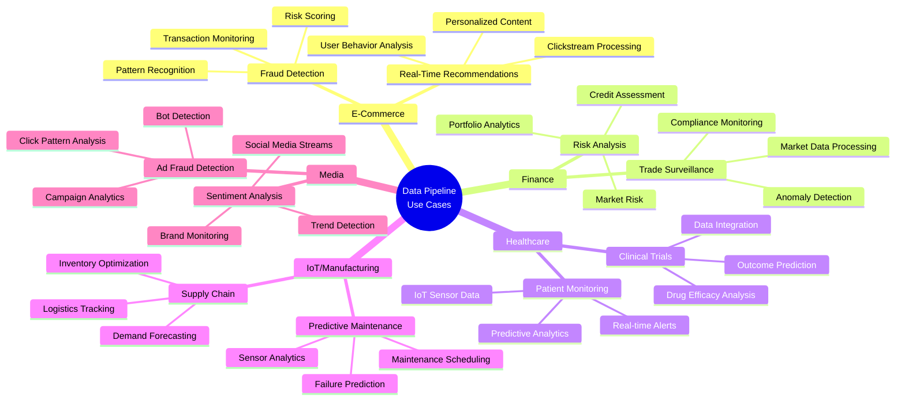

### <span style="color: #22c55e;">Use Case Highlights</span>

- **Real-Time Recommendations:**
  Process clickstream data to generate personalized product recommendations.
- **Fraud Detection:**
  Detect unusual purchasing patterns or multiple high-value transactions in real-time.

### <span style="color: #22c55e;">E-Commerce Use Cases</span>

- **Risk Analysis:**
  Aggregate transaction data to assess customer credit risk.
- **Trade Surveillance:**
  Monitor market data and employee trades for insider trading signals.

### <span style="color: #22c55e;">Finance Use Cases</span>

- **Patient Monitoring:**
  Process sensor data from medical devices to alert healthcare providers of critical conditions.
- **Clinical Trial Analysis:**
  Analyze historical trial data for predictive analytics in treatment outcomes.

### <span style="color: #22c55e;">Healthcare Use Cases</span>

- **Predictive Maintenance:**
  Monitor sensor data from machinery to predict failures before they occur.
- **Supply Chain Optimization:**
  Aggregate data across manufacturing processes to optimize production and logistics.

### <span style="color: #22c55e;">IoT and Manufacturing Use Cases</span>

- **Sentiment Analysis:**
  Analyze social media feeds in real-time to gauge public sentiment on new releases.
- **Ad Fraud Detection:**
  Identify and block fraudulent clicks on digital advertisements.

Feel free to use this pipeline as a starting point for your data processing needs. Extend it with additional components, services, or integrations to build a robust, end-to-end data platform.

## <span style="color: #0ea5e9;">Troubleshooting & Further Considerations</span>

- **Service Not Starting:**
  - Run `make ps` to identify unhealthy containers.
  - Run `make logs` for core service logs.
  - Recreate services with `make up`.
- **Airflow Connection Issues:**
  - Verify Airflow connections match values in `infra/compose/docker-compose.yaml`.
  - Validate network resolution from Airflow container to MySQL/PostgreSQL hostnames.
- **Data Quality Errors:**
  - Inspect Great Expectations output in DAG logs.
  - Update expectation suites in `great_expectations/expectations/` to reflect source changes.
- **Streaming Backlog or Lag:**
  - Check Kafka health and topic throughput.
  - Confirm Spark streaming job is active and consuming events.
- **Resource Constraints:**
  - Increase memory/CPU allocation for Docker Desktop or host VM.
  - For production, run Spark and Kafka as managed or scaled cluster services.

## <span style="color: #0ea5e9;">Contributing</span>

Contributions, issues, and feature requests are welcome!

1. Fork the Project
2. Create your Feature Branch (`git checkout -b feature/AmazingFeature`)
3. Commit your Changes (`git commit -m 'Add some AmazingFeature'`)
4. Push to the Branch (`git push origin feature/AmazingFeature`)
5. Open a Pull Request
6. We will review your changes and merge them into the main branch upon approval.

## <span style="color: #0ea5e9;">License</span>

This project is licensed under the MIT License.

MIT License

Copyright (c) 2025 paulchen8206@github

Permission is hereby granted, free of charge, to any person obtaining a copy
of this software and associated documentation files (the "Software"), to deal
in the Software without restriction, including without limitation the rights
to use, copy, modify, merge, publish, distribute, sublicense, and/or sell
copies of the Software, and to permit persons to whom the Software is
furnished to do so, subject to the following conditions:

The above copyright notice and this permission notice shall be included in all
copies or substantial portions of the Software.

THE SOFTWARE IS PROVIDED "AS IS", WITHOUT WARRANTY OF ANY KIND, EXPRESS OR
IMPLIED, INCLUDING BUT NOT LIMITED TO THE WARRANTIES OF MERCHANTABILITY,
FITNESS FOR A PARTICULAR PURPOSE AND NONINFRINGEMENT. IN NO EVENT SHALL THE
AUTHORS OR COPYRIGHT HOLDERS BE LIABLE FOR ANY CLAIM, DAMAGES OR OTHER
LIABILITY, WHETHER IN AN ACTION OF CONTRACT, TORT OR OTHERWISE, ARISING FROM,
OUT OF OR IN CONNECTION WITH THE SOFTWARE OR THE USE OR OTHER DEALINGS IN THE
SOFTWARE.

## <span style="color: #0ea5e9;">Final Notes</span>

This pipeline is designed for rapid prototyping and production hardening. With targeted configuration and integration work, it can support use cases such as real-time analytics, anomaly detection, predictive maintenance, and ML-enabled decision systems.

If this repository is useful, please consider starring it. Questions, feedback, and suggestions are welcome via [GitHub](https://github.com/paulchen8206).

[**⬆️ Back to top**](#modern-data-stack-with-batch--streaming-processing)
