# 🧭 System Architecture Documentation 🔷

## Table of Contents

1. [Overview](#overview)
1. [System Architecture](#system-architecture)
1. [Component Architecture](#component-architecture)
1. [Data Flow Architecture](#data-flow-architecture)
1. [Technology Stack](#technology-stack)
1. [Deployment Architecture](#deployment-architecture)
1. [Security Architecture](#security-architecture)
1. [Scalability & Performance](#scalability--performance)
1. [Monitoring & Observability](#monitoring--observability)
1. [Disaster Recovery](#disaster-recovery)
1. [AWS Well-Architected Design Alignment](#aws-well-architected-design-alignment)
1. [Decision Records](#decision-records)

## Overview

This document provides a comprehensive architectural overview of the Modern Data Stack system, designed to handle both batch and streaming data processing at scale. The architecture follows cloud-native principles, emphasizing scalability, reliability, and maintainability.

### Current Implementation Update

- GitHub Actions are separated into CI (`.github/workflows/ci.yml`) and CD (`.github/workflows/cd.yml`).
- Branch and environment flow is standardized: push `dev` for CI/dev checks, PR to `qa`/`stg`/`prd` for env-specific CI checks and Helm CD deployment.
- Kubernetes packaging is standardized through `helm/modern-data-stack` with base values and per-environment overlays.
- Local runtime has two supported paths:
  - Docker Compose (`infra/compose/docker-compose.yaml`) for integrated service development.
  - Kind (`k8s/kind/stack.yaml`) for local Kubernetes validation.
- Compose data layer intentionally separates project and Conduktor metadata into two Postgres services (`postgres` and `postgres-conduktor`).
- Local deployment and verification scripts are standardized in `ops/deploy-kind.sh` and `ops/kind-smoke.sh`.

### How to Read This Document

- Start with `System Architecture` for high-level context.
- Use `Component Architecture` and `Data Flow Architecture` for implementation-level understanding.
- Review `Security`, `Scalability`, and `Disaster Recovery` sections before production rollout.
- Use this document together with `docs/QUICK_START.md` and `docs/DEPLOYMENT.md` for execution details.

### Architectural Principles

- **Microservices Architecture**: Loosely coupled services that can be developed, deployed, and scaled independently
- **Event-Driven Architecture**: Asynchronous communication between components using message queues
- **Data Mesh Principles**: Decentralized data ownership with federated governance
- **Cloud-Native Design**: Containerized workloads orchestrated by Kubernetes
- **Infrastructure as Code**: Declarative infrastructure management using Terraform

### AWS Well-Architected Design Alignment

Project design considerations are aligned with AWS Well-Architected Framework best practices and documented in `docs/AWS_WELL_ARCHITECTED.md`.

Reference:

- AWS Well-Architected Framework: <https://docs.aws.amazon.com/wellarchitected/latest/framework/welcome.html>

## System Architecture

### High-Level System Context

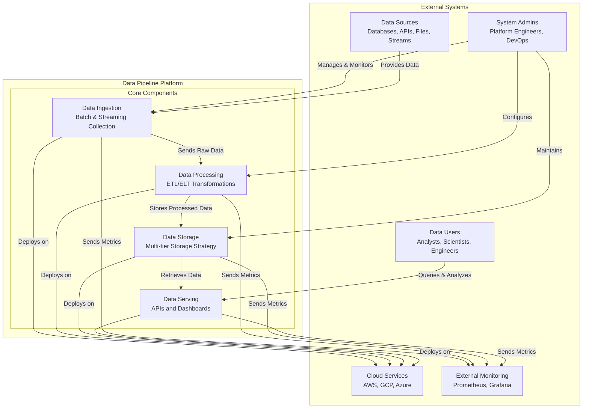

### Layered Architecture View

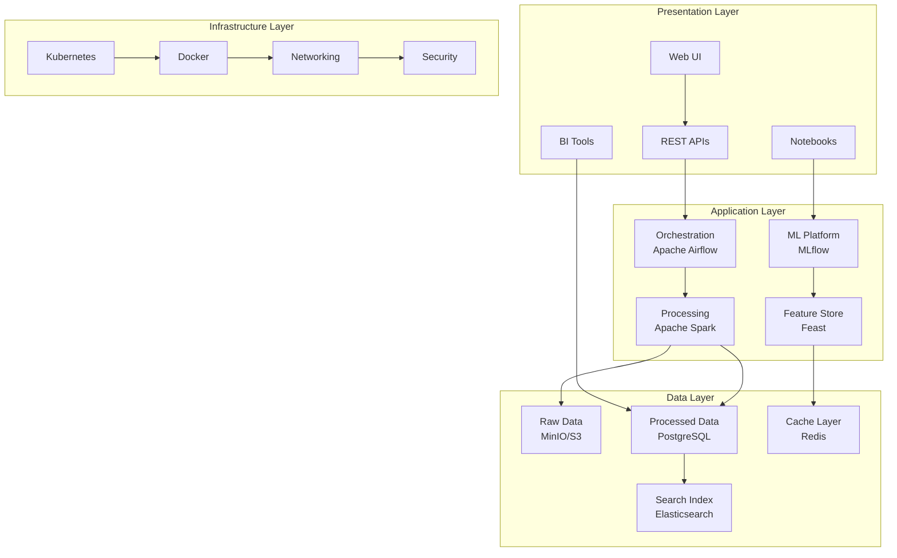

## Component Architecture

### Ingestion Components

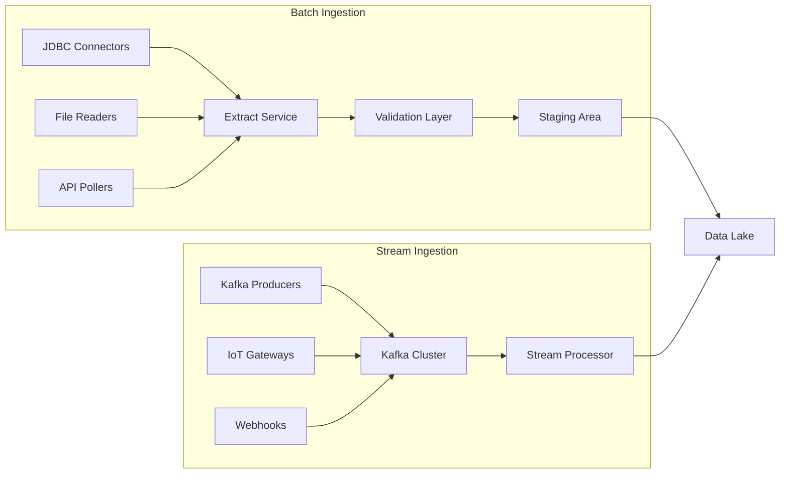

### Processing Components

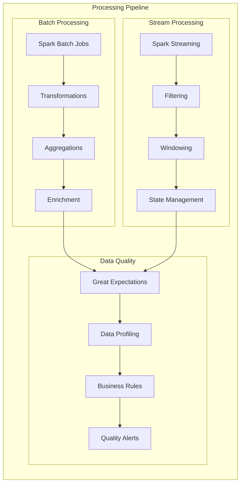

### Storage Components

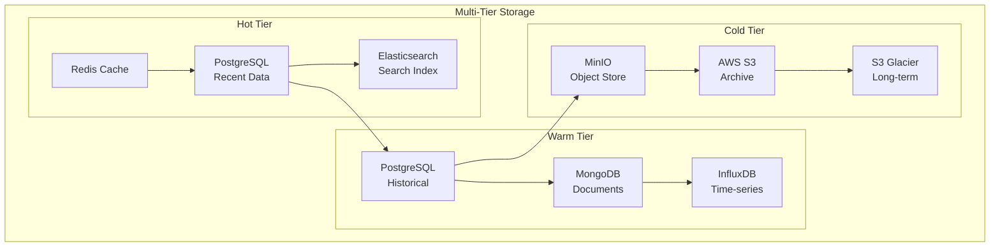

### Operational Procedures by Component

Ingestion and orchestration:

1. Start platform and verify source connectivity.
1. Run one controlled DAG execution before enabling schedule.
1. Confirm successful writes to raw and processed layers.

Processing and quality:

1. Execute batch and streaming jobs in isolation first.
1. Validate Great Expectations results before publish.
1. Capture run metadata for traceability and replay.

Storage:

1. Verify raw object creation and processed table updates.
1. Check storage growth and retention policy adherence.
1. Validate read-path latency for downstream consumers.

Observability:

1. Confirm metrics ingestion for Airflow, Kafka, Spark, and storage.
1. Validate alert routes with controlled failure tests.
1. Keep dashboards aligned with SLOs and release criteria.

### Best Practices by Component

Orchestration:

- Keep DAGs idempotent and parameterized.
- Push compute to Spark jobs, not DAG tasks.

Streaming:

- Enforce schema contracts and safe evolution.
- Design for at-least-once processing with idempotent sinks.

Data quality:

- Separate warning-level checks from blocking checks.
- Trend quality metrics over time to detect drift.

Storage:

- Keep raw immutable zone and curated modeled zone distinct.
- Apply retention/compaction policies by data tier.

Governance and ML:

- Link lineage to stable dataset identifiers.
- Track model runs with data snapshot and config metadata.

## Data Flow Architecture

### End-to-End Data Flow

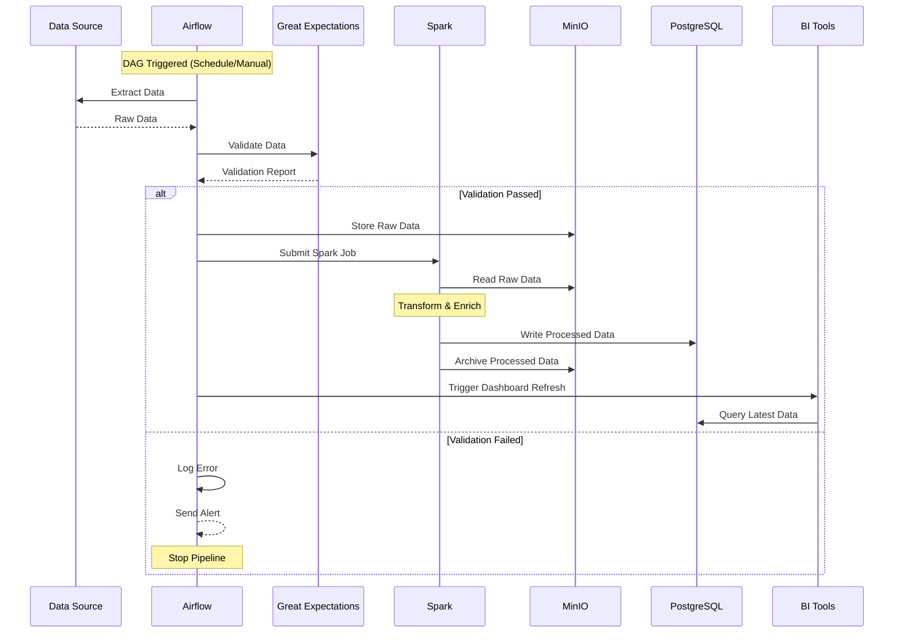

### Batch Processing Flow

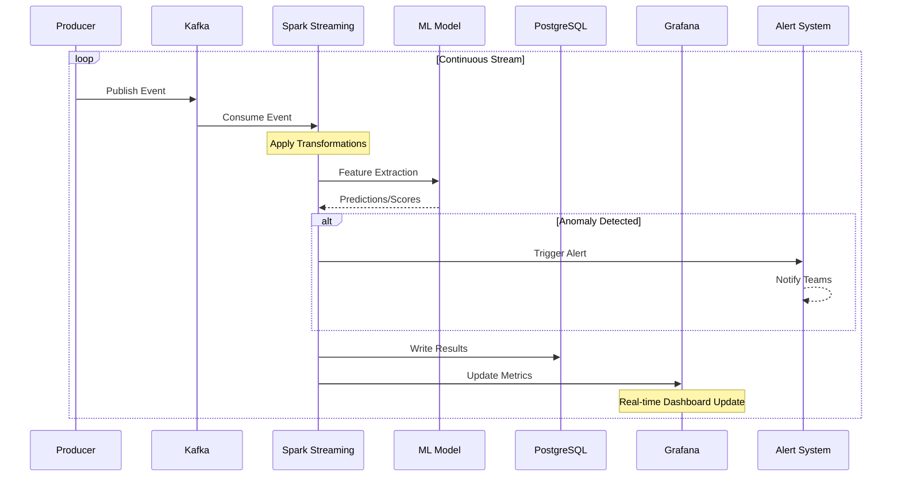

### Streaming Processing Flow

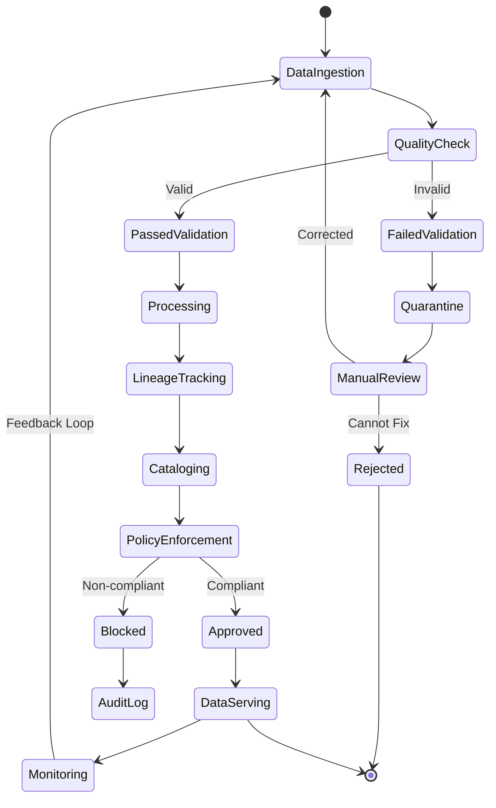

## Technology Stack

### Technology Selection Rationale

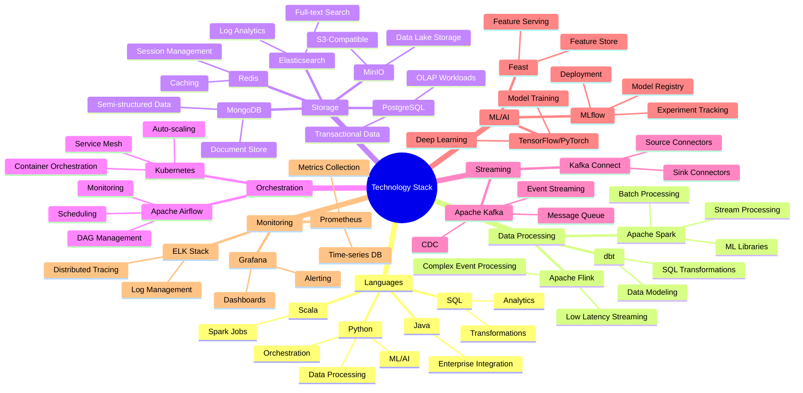

### Detailed Technology Matrix

- **Batch Processing**
    Technology: Apache Spark
    Rationale: Mature ecosystem; unified batch/stream API; strong ML support
    Alternatives considered: Hadoop MapReduce, Apache Beam
- **Stream Processing**
    Technology: Spark Streaming
    Rationale: Integration with batch; exactly-once semantics; micro-batch architecture
    Alternatives considered: Apache Flink, Apache Storm
- **Message Queue**
    Technology: Apache Kafka
    Rationale: High throughput; durability; stream replay capability
    Alternatives considered: RabbitMQ, AWS Kinesis
- **Orchestration**
    Technology: Apache Airflow
    Rationale: Rich UI; extensive operators; Python-native
    Alternatives considered: Prefect, Dagster, Luigi
- **Object Storage**
    Technology: MinIO
    Rationale: S3-compatible; self-hosted option; high performance
    Alternatives considered: AWS S3, Azure Blob, GCS
- **OLAP Database**
    Technology: PostgreSQL
    Rationale: SQL compliance; extensions ecosystem; cost-effective
    Alternatives considered: Snowflake, ClickHouse, BigQuery
- **Container Orchestration**
    Technology: Kubernetes
    Rationale: Industry standard; cloud-agnostic; rich ecosystem
    Alternatives considered: Docker Swarm, Nomad
- **Monitoring**
    Technology: Prometheus + Grafana
    Rationale: Open source; Kubernetes native; flexible querying
    Alternatives considered: DataDog, New Relic, CloudWatch

## Deployment Architecture

### Multi-Environment Deployment Model

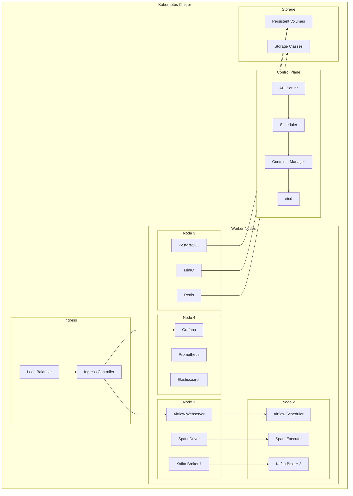

### Kubernetes Deployment Architecture

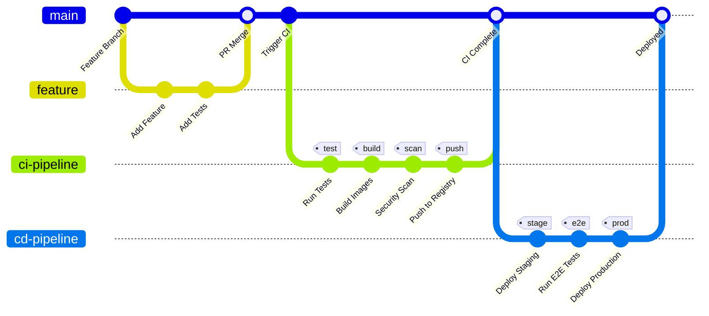

### CI/CD Pipeline Architecture

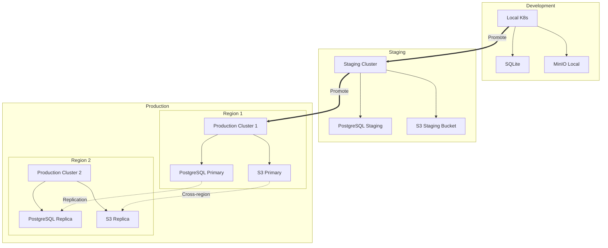

## Security Architecture

### Defense in Depth Strategy

```mermaid
graph TB
    subgraph "Security Architecture"
        subgraph "Network Security"
            FW[Firewall]
            WAF[Web Application Firewall]
            DDOS[DDoS Protection]
            VPN[VPN Gateway]
        end

        subgraph "Identity & Access"
            IAM[IAM Service]
            OAUTH[OAuth 2.0]
            RBAC[RBAC Policies]
            MFA[Multi-Factor Auth]
        end

        subgraph "Data Security"
            ENCRYPT_TRANSIT[Encryption in Transit]
            ENCRYPT_REST[Encryption at Rest]
            DLP[Data Loss Prevention]
            MASK[Data Masking]
        end

        subgraph "Application Security"
            SAST[SAST Scanning]
            DAST[DAST Testing]
            DEPEND[Dependency Scanning]
            SECRETS[Secrets Management]
        end

        subgraph "Compliance"
            AUDIT[Audit Logging]
            COMPLY[Compliance Monitoring]
            PRIVACY[Privacy Controls]
            RETAIN[Data Retention]
        end
    end

    FW --> WAF
    WAF --> DDOS
    DDOS --> VPN

    IAM --> OAUTH
    OAUTH --> RBAC
    RBAC --> MFA

    ENCRYPT_TRANSIT --> ENCRYPT_REST
    ENCRYPT_REST --> DLP
    DLP --> MASK

    SAST --> DAST
    DAST --> DEPEND
    DEPEND --> SECRETS

    AUDIT --> COMPLY
    COMPLY --> PRIVACY
    PRIVACY --> RETAIN
```

### Data Security and Privacy

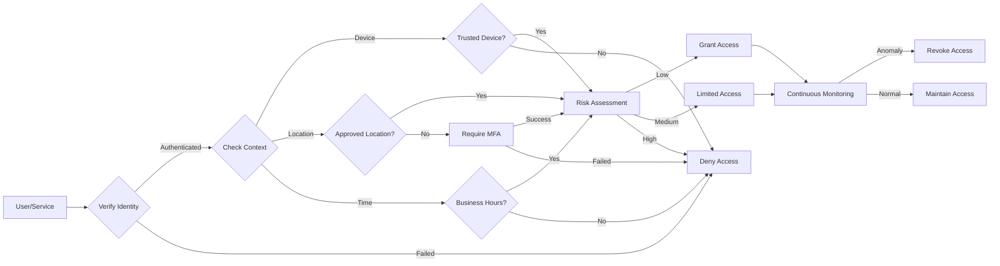

## Scalability & Performance

### Horizontal and Vertical Scaling

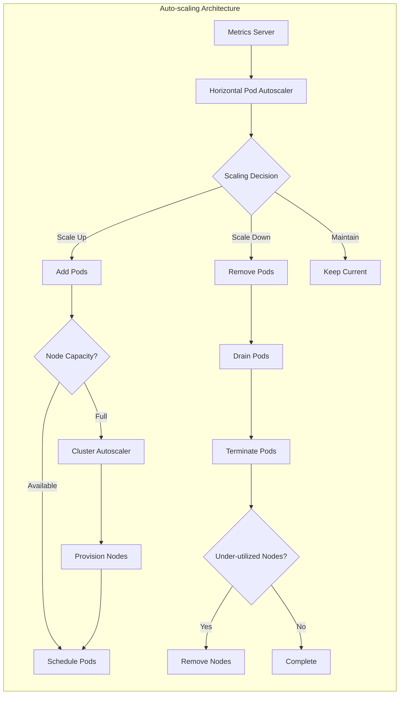

### Performance Optimization Strategy

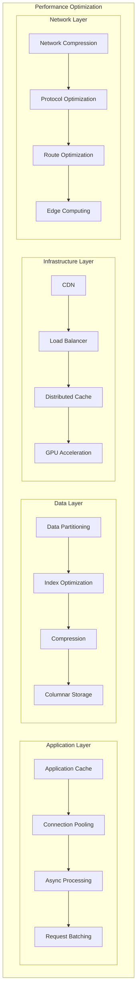

## Monitoring & Observability

### Observability Architecture

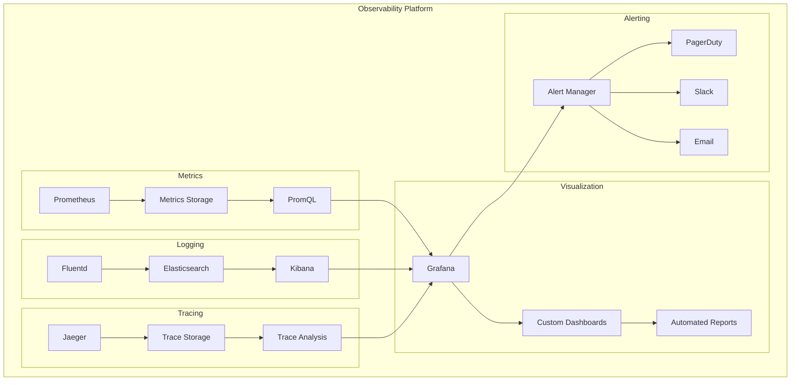

### Alerting and Incident Response

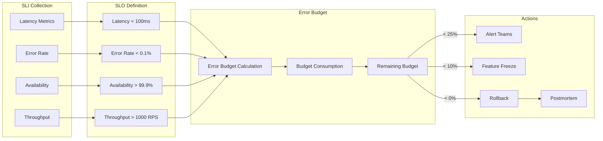

## Disaster Recovery

### SLOs and Operational Metrics

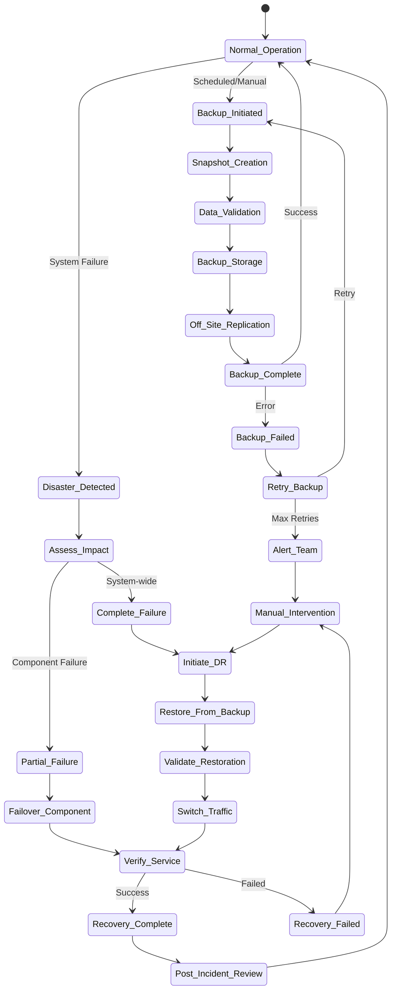

### Backup and Recovery Architecture

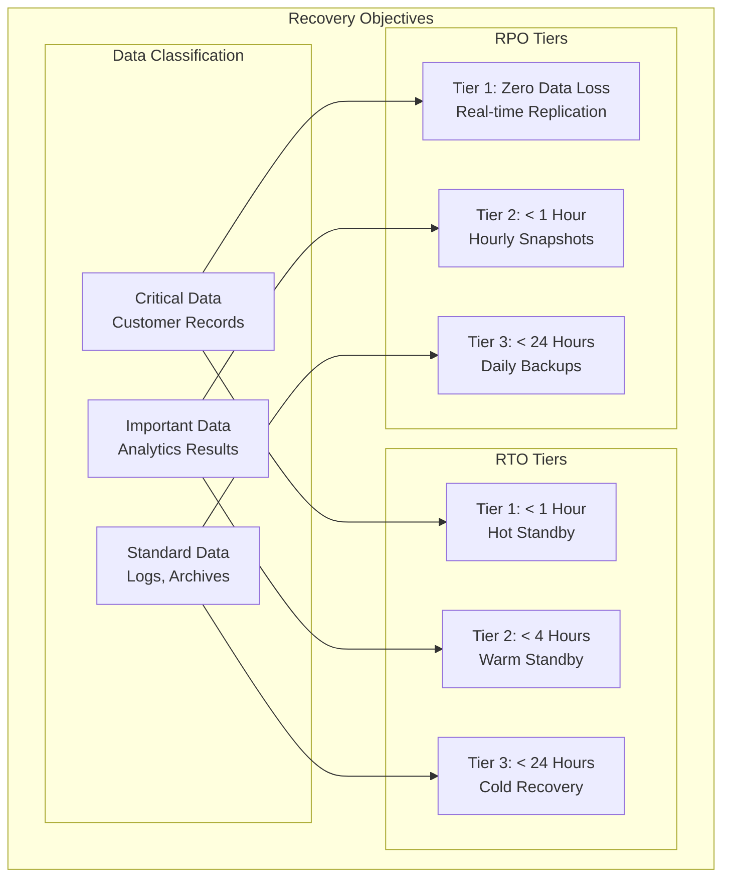

### Multi-Region and High Availability Strategy

```mermaid
sequenceDiagram
    participant Client
    participant DNS
    participant LB_Primary as Load Balancer (Primary)
    participant Region_A as Region A (Primary)
    participant Region_B as Region B (Standby)
    participant Health as Health Check
    participant Sync as Data Sync

    Note over Region_A, Region_B: Normal Operation

    loop Continuous
        Sync->>Region_A: Read Changes
        Sync->>Region_B: Replicate Data
        Health->>Region_A: Health Check
        Health->>Region_B: Health Check
    end

    Client->>DNS: Resolve Endpoint
    DNS->>Client: Primary Region IP
    Client->>LB_Primary: Request
    LB_Primary->>Region_A: Forward Request
    Region_A->>Client: Response

    Note over Region_A: Disaster Occurs

    Health->>Region_A: Health Check
    Region_A--xHealth: No Response
    Health->>Health: Mark Unhealthy
    Health->>DNS: Update DNS

    DNS->>DNS: Failover to Region B

    Client->>DNS: Resolve Endpoint
    DNS->>Client: Region B IP
    Client->>Region_B: Request
    Region_B->>Client: Response

    Note over Region_A: Recovery Process

    Region_A->>Health: Service Restored
    Health->>Region_A: Verify Health
    Health->>Sync: Initiate Sync
    Sync->>Region_B: Read Recent Changes
    Sync->>Region_A: Apply Changes

    Note over Region_A, Region_B: Failback (Optional)

    Health->>DNS: Update DNS
    DNS->>DNS: Route to Primary
```

## Decision Records

Use architecture decision records (ADRs) to document why key technical choices were made, what alternatives were considered, and how to revisit those choices safely.

### When to Create an ADR

- Adopting or replacing a core component (for example Kafka, Airflow, Spark, storage engine).
- Introducing a cross-cutting pattern (security, observability, deployment strategy).
- Changing interfaces, data contracts, or persistence strategy with operational impact.

### ADR Workflow

1. Create one ADR per significant decision.
1. Keep status explicit: `Proposed`, `Accepted`, `Superseded`, or `Rejected`.
1. Link related runbooks, metrics, and rollback plans.
1. Update or supersede ADRs instead of rewriting history.

### ADR Template

```md
# ADR-00X: <Short Decision Title>

- Date: YYYY-MM-DD
- Status: Proposed | Accepted | Superseded | Rejected
- Owners: <team/person>
- Related Components: <airflow|kafka|spark|minio|postgres|monitoring|security>
- Related Docs: <links>

## Context

What problem are we solving? What constraints apply (cost, latency, scale, compliance, team skills)?

## Decision

State the chosen approach clearly and specifically.

## Alternatives Considered

1. Option A: <summary, pros, cons>
1. Option B: <summary, pros, cons>
1. Option C: <summary, pros, cons>

## Consequences

- Positive: <benefits>
- Negative: <trade-offs>
- Operational Impact: <runbook/monitoring/SLO changes>

## Rollout Plan

1. <step>
1. <step>
1. <validation criteria>

## Rollback Plan

1. <trigger conditions>
1. <rollback steps>
1. <post-rollback verification>

## Monitoring and Guardrails

- Key metrics: <list>
- Alert thresholds: <list>
- Exit criteria: <what makes this successful>
```

### Best Practices

- Prefer evidence-based decisions: include benchmark or incident data when possible.
- Keep ADRs concise; link to detailed docs rather than duplicating them.
- Make rollback criteria measurable and pre-agreed.
- Revisit ADRs after incidents or major scale changes.

## Key Takeaways and Next Steps

This architecture provides a robust, scalable, and maintainable foundation for enterprise-grade data processing. The modular design allows for independent scaling and evolution of components while maintaining system coherence through well-defined interfaces and protocols.

### Core Architecture Principles

1. **Modularity**: Each component can be developed, tested, and deployed independently
1. **Scalability**: Horizontal scaling at every layer ensures system can grow with demand
1. **Resilience**: Multiple layers of redundancy and failover mechanisms
1. **Observability**: Comprehensive monitoring and logging at all levels
1. **Security**: Defense in depth with multiple security layers
1. **Flexibility**: Technology choices can be adapted based on specific requirements

### Recommended Next Actions

- Review and customize the architecture based on specific organizational needs
- Conduct proof of concept for critical components
- Develop detailed implementation plans for each subsystem
- Establish governance and operational procedures
- Create runbooks for common operational scenarios

---

For more information, see:

- [README.md](../README.md) - Project overview and setup instructions
- [Quick Start](./QUICK_START.md) - Practical setup and rollout steps
- [Containers Documentation](../infra/README.md) - Compose and Dockerfile layout
- [Kubernetes Manifests](../k8s/) - Deployment specifications
